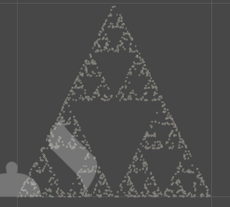

# Simple Fractals
Simple fractals is a visualization tool for fractals built with Unity.

### Todo:
- Camera movement.
- Optimizations.
- Pretty VFX.
- Exact VFX for better visualization.
- Resolution options for the render texture so we can reduce or add points.
  
### Extra features:
- User input.

